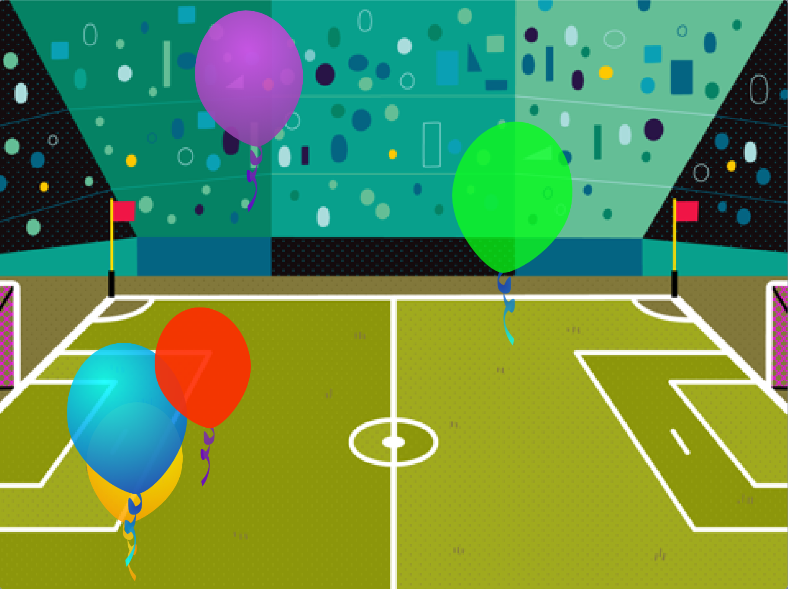

## Introduction
Create a project — relaxing, energising, funny, or inspiring — to try and change someone’s mood using sprites that move over a backdrop.

## What you will make
You will create your own project where you will choose your own sprites and backdrop to make a unique interactive animation. Your project might have balls bouncing around, birds that flap their wings, animals that move through the wood, or hearts that float around. Your sprites could do something when you click on them. For example, you could have a bird that squawks, a heart that glows, or a balloon that pops.

You will apply your skills to make a unique project of your own. You will be introduced to a range of creative projects where sprites are animated in different ways using loops. 

{:width="400px"}

--- collapse ---
---
title: What you will need
---
### Hardware

+ A computer or tablet capable of running Scratch

### Software

+ Scratch 3.0 (either [online](http://rpf.io/scratchon){:target="_blank"}, or [offline](http://rpf.io/scratchoff){:target="_blank"})

--- /collapse ---

--- collapse ---
---
title: Skills you should have
---
Before starting this project, we recommend you complete the the first three projects in the [Look after yourself](https://projects.raspberrypi.org/en/pathways/look-after-yourself){:target="_blank"} pathway: 
+ [Stress ball](https://learning-admin.raspberrypi.org/en/projects/stress-ball){:target="_blank"}
+ [Butterfly garden](https://learning-admin.raspberrypi.org/en/projects/butterfly-garden){:target="_blank"}
+ [Serene Scene](https://learning-admin.raspberrypi.org/en/projects/serene-scene){:target="_blank"}

For this project, you need to know how to:  

+ Add code to sprites and a backdrop
+ Use the tools in the Paint editor to add details to a sprite
+ Add `graphic effects`{:class="block3looks"} and `sound`{:class="block3sound"} to a sprite
+ Use `Motion`{:class="block3motion"} blocks to create animation
+ Use costumes to customise sprites
+ Use the `forever`{:class="block3control"} block
+ Use the `next costume`{:class="block3control"} and `wait`{:class="block3control"} blocks to animate a sprite

--- /collapse ---

--- collapse ---
---
title: What you will learn
---

+ How to apply your skills to realise your own project ideas
+ How to select the appropriate block for your plan
+ How to think about what you've made and the ways you can improve it

--- /collapse ---

--- collapse ---
---
title: Additional information for educators
---

You can [download the completed project here](http://rpf.io/p/en/make-a-difference-get).

If you need to print this project, please use the [printer-friendly version](https://projects.raspberrypi.org/en/projects/make-a-difference/print){:target="_blank"}.

--- /collapse ---

