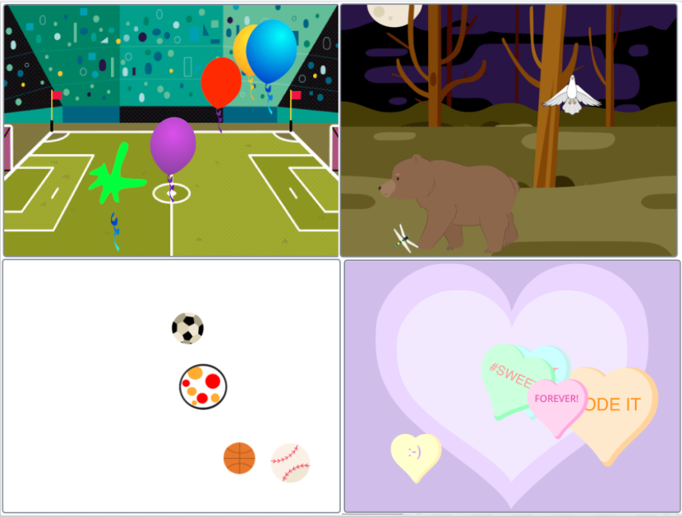

## Introduction
You're going to create a project to try and change someone's mood using sprites that move over a backdrop. You will choose a theme for your project such as relaxing, energising, funny, inspiring or something else - it's your choice.

## Skills you should have
To complete the Make a difference project you need to have the following skills which you will have learnt when completing the first two projects in the [Look after yourself](https://projects.raspberrypi.org/en/pathways/look-after-yourself) pathway: [Stress ball](https://learning-admin.raspberrypi.org/en/projects/stress-ball){:target="_blank"} and [Butterfly garden](https://learning-admin.raspberrypi.org/en/projects/butterfly-garden){:target="_blank"}:

+ Use the tools in the Paint editor to create your own stress ball sprite
+ Add a `sound`{:class="block3sound"} to your stress ball that is played when clicked
+ Add `graphic effects`{:class="block3looks"} to your stress ball to squash it
+ Use `Motion`{:class="block3motion"} blocks to create animated butterfly sprites
+ Use a `forever`{:class="block3control"} loop to make the butterflies fly repeatedly in the same pattern
+ Use the Paint editor to create your own unique butterfly sprites
+ How to create costumes in the Paint editor

You will now apply the above skills to create your own project where you will choose your own sprites and backdrop to create a unique interactive animation.

## What you will make
In this example project below, Popping balloons, the balloons move around the stage in different ways using loops. 

--- task ---

--- no-print ---
Click on the green flag to see this example project run. When you click on a balloon, it will pop and dissappear.

  <iframe allowtransparency="true" width="485" height="402" src="https://scratch.mit.edu/projects/embed/425346741/?autostart=false" frameborder="0"></iframe>

--- /no-print ---

--- print-only ---
{:width="400px"}
--- /print-only ---

--- /task ---

--- collapse ---
---
title: What you will need
---
### Hardware

+ A computer or tablet capable of running Scratch

### Software

+ Scratch 3.0 (either [online](http://rpf.io/scratchon){:target="_blank"} or [offline](http://rpf.io/scratchoff){:target="_blank"})

--- /collapse ---

--- collapse ---
---
title: What you will learn
---

+ How to apply your skills to realise your own project ideas
+ How to debug your program
+ How to reflect on your learning

--- /collapse ---

--- collapse ---
---
title: Additional information for educators
---

You can [download the completed project here](http://rpf.io/p/en/make-a-difference).

If you need to print this project, please use the [printer-friendly version](https://projects.raspberrypi.org/en/projects/make-a-difference/print){:target="_blank"}.

--- /collapse ---
