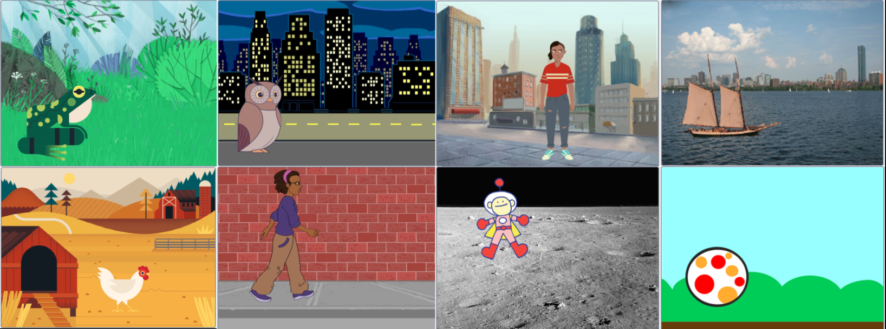

## Choose your theme

Now it's time to start working on your own project. You may be bursting with ideas already, or you may need to take a few minutes to decide on a theme you want to work with.

--- task ---

Open a [new Scratch project](https://scratch.mit.edu/projects/editor){:target=”_blank”}, to look at the range of sprites and backdrops, and take 5 minutes to think about **your** Make a difference project. 

+ What mood do you want to create? Relaxing, Energising, Funny?
+ Which backdrop will you choose? 
+ Which sprites will you choose? 
+ Maybe you will just start with one sprite and add more if you have time.

--- /task ---

--- task ---
Add a backdropA background image that appears behind all of the sprites and can't move. of your choice. Don't worry too much as you can change at any time as you develop your idea. Below is an example of a **How to …**. You can use these if you need a reminder or to understand blocks in more detail.

[[[generic-scratch3-backdrop-from-library]]]

--- /task ---

--- task ---
Add your first spriteA character or object in a project, such as a Cat or a Ball.. You will always be able to change the way it looks or add more sprites later if you have time. 

[[[generic-scratch3-sprite-from-library]]]

--- /task ---

--- task ---

Give your project a name that matches your theme. 

--- collapse ---
---

title: How do I give my project a name?

---

Click in the project name box and change the name to match your project. 

If you share your project then others will see this name so make sure it makes sense. 

--- /collapse --- 

--- /task ---

--- save ---

