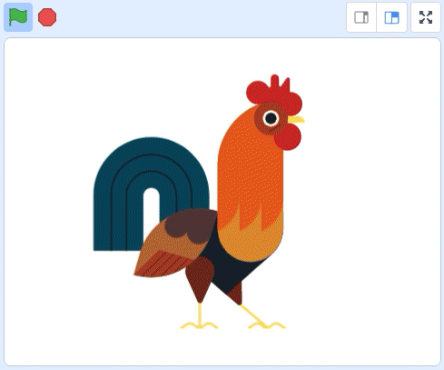

## Change your sprite's looks

Now let's look at different ways to change the appearance of your sprite, such as its size, colour or graphic effects like the ghost effect.

--- task ---

Think about how you want your sprite to look on the screen. What size will look and work best? Do you want to use graphic effects such a the ghost effect? Does your sprite need to change costumes?

**Sun** - <a href="https://scratch.mit.edu/projects/425346741/editor/" target="_blank" style="background-color: #4d97ff; color: white; font-weight: bold; padding: 1rem; border-radius:.25rem; text-decoration:none;">See Inside</a>

<div class="scratch-preview">
  <iframe allowtransparency="true" width="485" height="402" src="https://scratch.mit.edu/projects/embed/425346741/?autostart=false" frameborder="0"></iframe>
</div>

--- /task ---

--- task ---

**How to ...:** have a quick look at the reminders below for any `looks`{:class="block3looks"} effects you want to try out. Have a play around and investigate any effects that are new to you. 

**Hint:** It is always good to try one change at a time and test what it does so that you can easily undo any changes that you are not keen on, or make little tweeks as you go along.

--- collapse ---
---
title: Set size
---

When you add a sprite to your project its size is set to 100%. This might be too big or too small for your project. 

You can use code to set the size of a sprite. 

```blocks3
set size to (50) %
```

If you set the size of a sprite to 50% it will be half as tall and half as wide. If you set the size of a sprite to 200% it will be twice as tall and twice as wide. 

If place a `set size`{:class="block3looks"} block under a `when green flag clicked`{:class="block3control"} to set the size of a sprite when the project is started. 

You can also quickly set the size of a sprite by changing its Size under the Stage:

{:width="400px"}


--- /collapse ---

--- collapse ---
---
title: Change size to create a pulsing effect
---

**Beating heart** - <a href="https://scratch.mit.edu/projects/435725413/editor/" target="_blank" style="background-color: #4d97ff; color: white; font-weight: bold; padding: 1rem; border-radius:.25rem; text-decoration:none;">See Inside</a>

<div class="scratch-preview">
  <iframe allowtransparency="true" width="485" height="402" src="https://scratch.mit.edu/projects/embed/435725413/?autostart=false" frameborder="0"></iframe>
</div>

You can use the `set size`{:class="block3looks"} or `change size`{:class="block3looks"} to create a pulsing effect, such as a beating heart.

**Note:** The `set size`{:class="block3looks"} block sets size to a specific value while the `change size`{:class="block3looks"} changes the value from what it previously was, e.g. `change size by 10`{:class="block3looks"}, adds `10` to the value of size.

```blocks3
when flag clicked
set size to (160) %
forever
change size by (40)
wait (0.2) seconds
change size by (20)
wait (0.2) seconds
change size by (-20)
wait (0.2) seconds
change size by (-40)
wait (0.2) seconds
end
```

This code uses a series of `change sizes`{:class="block3looks"} and `waits`{:class="block3control"} to make the heart grow and shrink. Try creating your own pulsating sprite.

--- /collapse ---

--- collapse ---
---
title: Graphic effects
---

**Rooster effects** - <a href="https://scratch.mit.edu/projects/435730522/editor/" target="_blank" style="background-color: #4d97ff; color: white; font-weight: bold; padding: 1rem; border-radius:.25rem; text-decoration:none;">See Inside</a>

<div class="scratch-preview">
  <iframe allowtransparency="true" width="485" height="402" src="https://scratch.mit.edu/projects/embed/435730522/?autostart=false" frameborder="0"></iframe>
</div>

You can use the `set size`{:class="block3looks"} or `change size`{:class="block3looks"} to create a pulsing effect, such as a beating heart.

**Note:** The `set size`{:class="block3looks"} block sets size to a specific value while the `change size`{:class="block3looks"} changes the value from what it previously was, e.g. `change size by 10`{:class="block3looks"}, adds `10` to the value of size.

```blocks3
when flag clicked
set size to (160) %
forever
change size by (40)
wait (0.2) seconds
change size by (20)
wait (0.2) seconds
change size by (-20)
wait (0.2) seconds
change size by (-40)
wait (0.2) seconds
end
```

This code uses a series of `change sizes`{:class="block3looks"} and `waits`{:class="block3control"} to make the heart grow and shrink. Try creating your own pulsating sprite.

--- /collapse ---


--- /task ---

**Old Markdown below**

### Special graphics effects

The `set colour`{:class="block3looks"} and `change colour`{:class="block3looks"} blocks both have drop down boxes where you can choose from a range of different graphic effects such as whirl, brightness and a ghost effect, that can be used to change how your sprites appear.

--- no-print ---

--- /no-print ---


--- task ---


--- collapse ---
---

title: Using graphics effects

---


```blocks3


```

--- /collapse ---


--- /task ---

--- task ---

--- collapse ---
---

title: How to create a simple sprite animation

---

Use `next costume`{:class="block3looks"} inside a `forever`{:class="block3control"} loop with a `wait`{:class="block3control"} to create an animation: 

```blocks3
when flag clicked
forever
next costume
wait (0.2) seconds
```

One second is often too long to wait before changing to the next costume so you need to use numbers smaller than 1 in the `wait` block. A wait of `0.1` is one tenth of a second and `0.5` is half a second. If you wait `0.2` seconds then the sprite will change costumes five times every second. 

When a sprite reaches its last costume,  the `next costume`{:class="block3looks"} block will go back to the first costume so the sprite will keep moving. 

You can combine animation with movement to create sprites that walk or fly: 

```blocks3
when flag clicked
point in direction (90)
set rotation style [left-right v]
forever
move (5) steps
next costume
if on edge, bounce
wait (0.2) seconds
```

--- /collapse ---

--- /task ---

--- task ---

You've explored the bottom part of the **Yellow Balloon** sprite's script. Now let's look at the top part of the script to understand how it the blocks used affect the sprite's appearance.

Investigate the `Looks`{:class="block3looks"} blocks which are highlighted below. Read the code, line by line, to identify what each `Looks`{:class="block3looks"} block does:

```blocks3
when flag clicked
+ set size to (80)%
+ clear graphic effects :: looks
+ set [ghost v] effect to (15)
point in direction (0)
+ show
forever
move (5) steps
if on edge, bounce
end
```
--- /task ---

Is your sprite the size you want it to be? If not, you can easily adjust it. Varying the size of your sprites will create more depth to your animation. Notice, in the Popping balloons example project, how the ballons **appear** to float 3-dimensionally within the Backdrop. This effect is created just because the balloons vary size.

--- task ---

Add a `set size to %`{:class="block3looks"} block and play about with the percentage `value` until you are happy with the sprite's size. You may also resize the sprite again later when you have more sprites. You can then resize the sprites in relation to each other.

--- /task ---

--- task ---

You now need to add in a `clear graphic effects`{:class="block3looks"} block and `show`{:class="block3looks"} block so that `when greeen flag clicked`{:class="block3events"} the sprite goes back to its original shape and shows again on the screen.

--- /task ---

--- task ---

To make the **Yellow Balloon** sprite appear more realistic it has been made a little transparent using the `set the ghost effect`{:class="block3looks"} using a value of `15`. Making your sprite transparent may not fit your project idea and that's fine! Why not use another `graphic effect`{:class="block3looks"} instead?

Whatever sprite you choose, investigate the **How to... create graphic effects** as a source of inspiration.

--- collapse ---
---

title: How to ... create graphic effects

---
--- /collapse ---

--- /task ---

--- save ---

--- collapse ---
---

title: Setting the size of a sprite

---

When you add a sprite to your project its size is set to 100%. This might be too big or too small for your project. 

You can set the size of a sprite by changing its Size under the Stage:


You can also use code to set the size of a sprite. 

```blocks3
set size to (50) %
```

If you set the size of a sprite to 50% it will be half as tall and half as wide. If you set the size of a sprite to 200% it will be twice as tall and twice as wide. 

You can set the size of a sprite under `when green flag clicked`{:class="block3control"} to set the size of a sprite when the project is started. 

--- /collapse ---