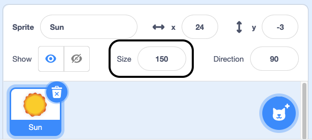
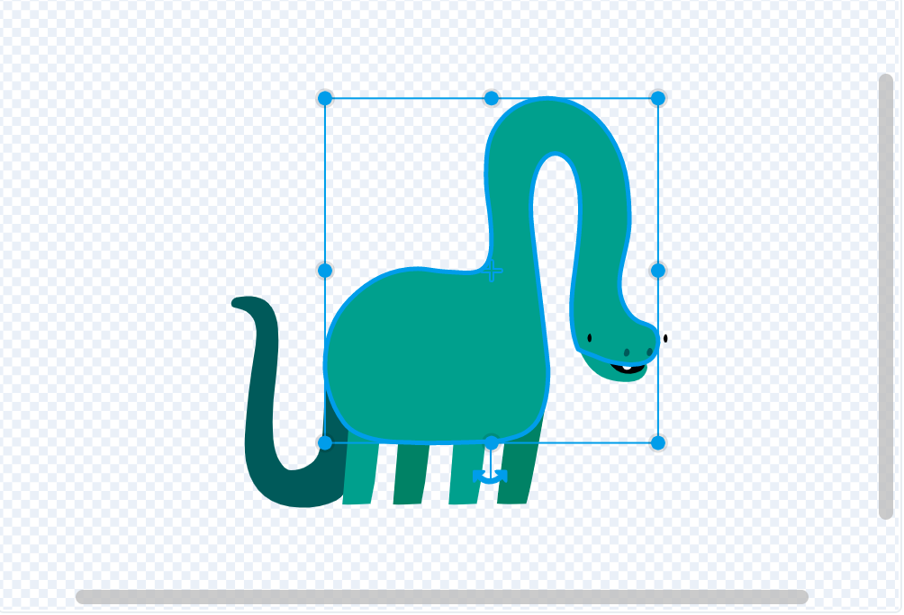
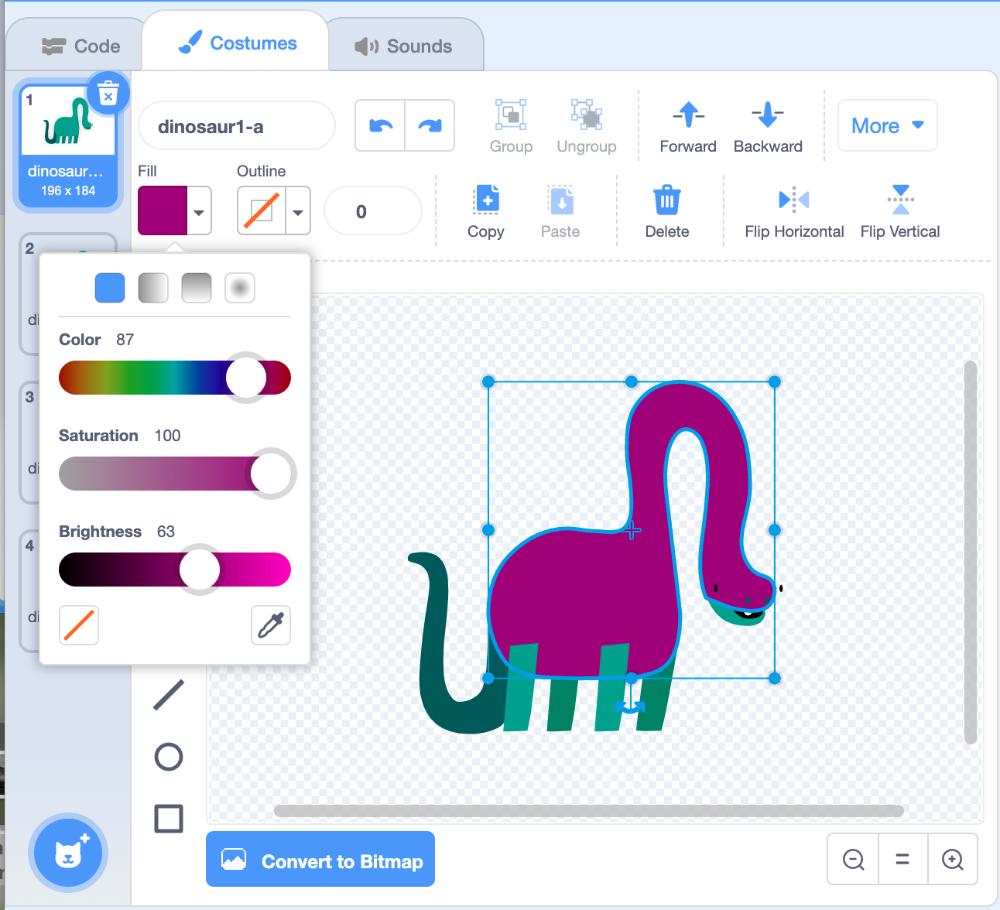
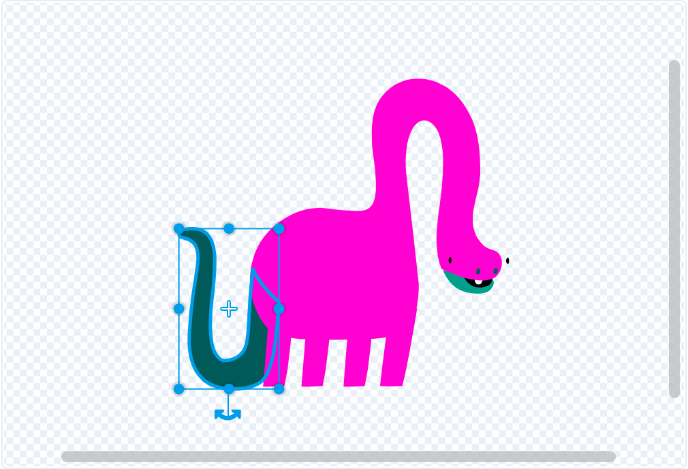
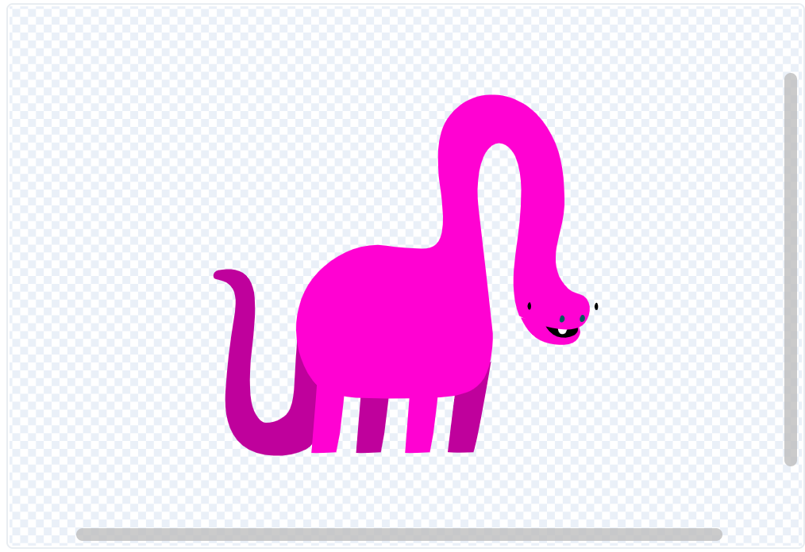
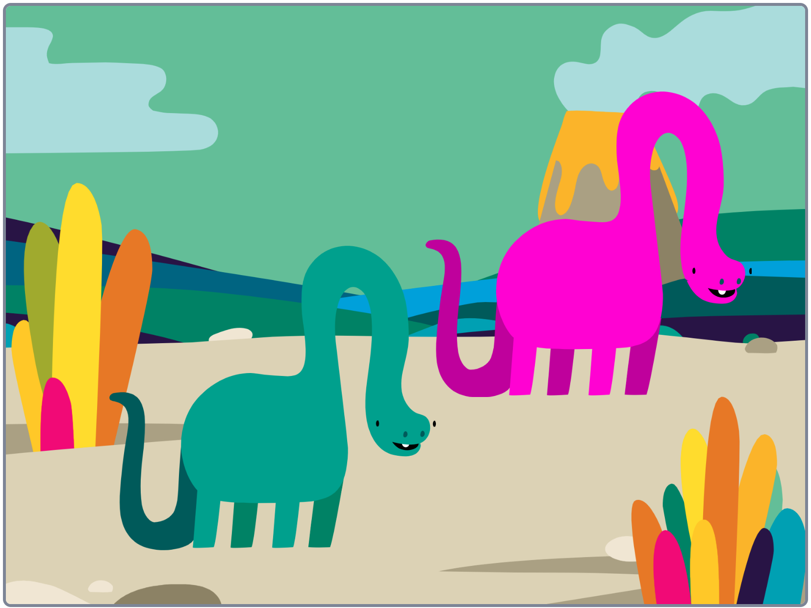

## Change the look of your sprite
Now you're going to change the appearance of your sprite.

--- task ---
First think about how you want your sprite to look when your project starts. What size will look and work best? Do you want to use graphic effects to change the appearance of your sprite?

This **Jellyfish**  sprite is small and you can see the backdrop through it:

**Jellyfish** - <a href="https://scratch.mit.edu/projects/436254947/editor" target="_blank" style="background-color: #4d97ff; color: white; font-weight: bold; padding: 1rem; border-radius:.25rem; text-decoration:none;">See inside</a>
<div class="scratch-preview">
  <iframe src="https://scratch.mit.edu/projects/436254947/embed" allowtransparency="true" width="485" height="402" frameborder="0" scrolling="no" allowfullscreen></iframe>
</div>

--- /task ---

You will add new scripts to your sprite so you will have more than one script that starts with `when green flag clicked`{:class="block3control"}. Each script will all run at the same time when you click the green flag to start your project. 

--- task ---

Add code to your sprite to change the way it looks. Only make changes to your sprite if it makes sense. If you are already happy with the way your sprite looks you can move to the next task.

You can use these examples to get started:

--- collapse ---
---
title: Set size
---

When you add a sprite to your project its size is set to 100%. This might be too big or too small for your project. 

You can use code to set the size of a sprite. 

```blocks3
set size to (50) %
```

If you set the size of a sprite to 50% it will be half as tall and half as wide. If you set the size of a sprite to 200% it will be twice as tall and twice as wide. 

Place a `set size`{:class="block3looks"} block under a `when green flag clicked`{:class="block3control"} to set the size of a sprite when the project is started: 

```blocks3
when flag clicked
set size to (50) %
```

You can also quickly set the size of a sprite by changing its Size under the Stage:

{:width="400px"}

--- /collapse ---

--- collapse ---
---
title: Set graphic effects
---

**Rooster effects** - <a href="https://scratch.mit.edu/projects/435730522/editor/" target="_blank" style="background-color: #4d97ff; color: white; font-weight: bold; padding: 1rem; border-radius:.25rem; text-decoration:none;">See inside</a>

<div class="scratch-preview">
  <iframe allowtransparency="true" width="485" height="402" src="https://scratch.mit.edu/projects/embed/435730522/?autostart=false" frameborder="0"></iframe>
</div>

Place a `set graphic effects`{:class="block3looks"} block under a `when green flag clicked`{:class="block3control"} to set the size of a sprite when the project is started:

```blocks3
when flag clicked
set [ghost v] effect to (25)
```

The `set color`{:class="block3looks"} and `color`{:class="block3looks"} blocks both have drop down boxes where you can choose from a range of different graphic effects that can be used to change how your sprite appears.

+ `color`{:class="block3looks"}: from 0 to 199 (bigger numbers will wrap around so 200 is the same as 0)
+ `fisheye`{:class="block3looks"}: 0 is no effect and bigger numbers give a bigger 'bulge' effect
+ `whirl`{:class="block3looks"}: 0 is no effect, big number give a big whirl to the left, big negative number give a big whirl to the right
+ `pixelate`{:class="block3looks"}: 0 is no effect, bigger numbers give more pixels
+ `mosaic`{:class="block3looks"}: 0 is no effect, bigger numbers create more copies
+ `brightness`{:class="block3looks"}: 0 is no effect, bigger numbers up to 100 make the sprite lighter and negative numbers down to -100 make the sprite darker 
+ `ghost`{:class="block3looks"}: 0 is no effect, bigger numbers up to 100 make the sprite more transparent, 

Try `setting`{:class="block3looks"} the different effect values to see what each one does. Explore how different value changes make your sprite look.

```blocks3
set [whirl v] effect to (100)

set [pixelate v] effect to (50)
```

--- /collapse ---

--- collapse ---
---

title: Use the Fill tool to change the colours in a costume

---

Select your sprite under the Stage and then click on **Costumes**. 

Change the colour of your sprite. Click on the second sprite in the Sprite menu. Then select its **Costumes** tab.

Use the **arrow tool** to highlight whichever part of the costume you want to change colour.

{:width="200px"}

{:width="300px"}

Go to the **Fill tool** and select the colour. It will automatically fill the shape that you have selected.

{:width="300px"}

Repeat the steps above with any part of the costume you have missed or for any other part of the costume you want to change the colour of.

{:width="300px"}

{:width="300px"}

{:width="300px"}


--- /collapse ---

--- /task ---


--- task ---
Work on your sprite until it looks the way you want. 

**Tip:** It is always good to try one change at a time and test what it does so that you can easily undo any changes that you are not keen on, or make little changes as you go along.

--- /task ---


--- save ---
