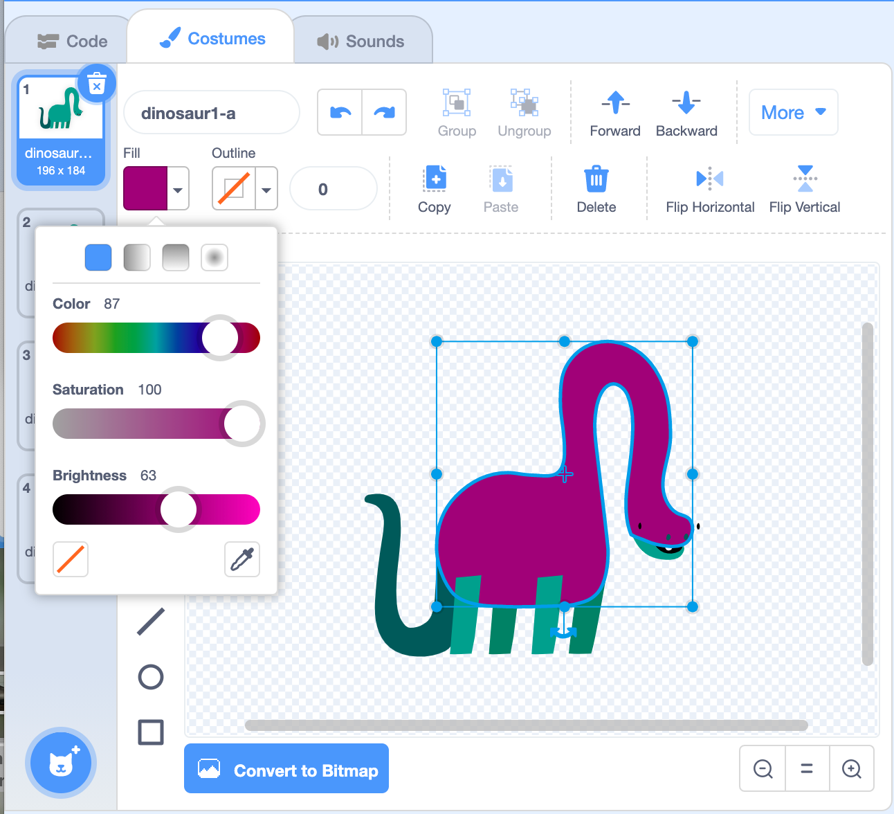
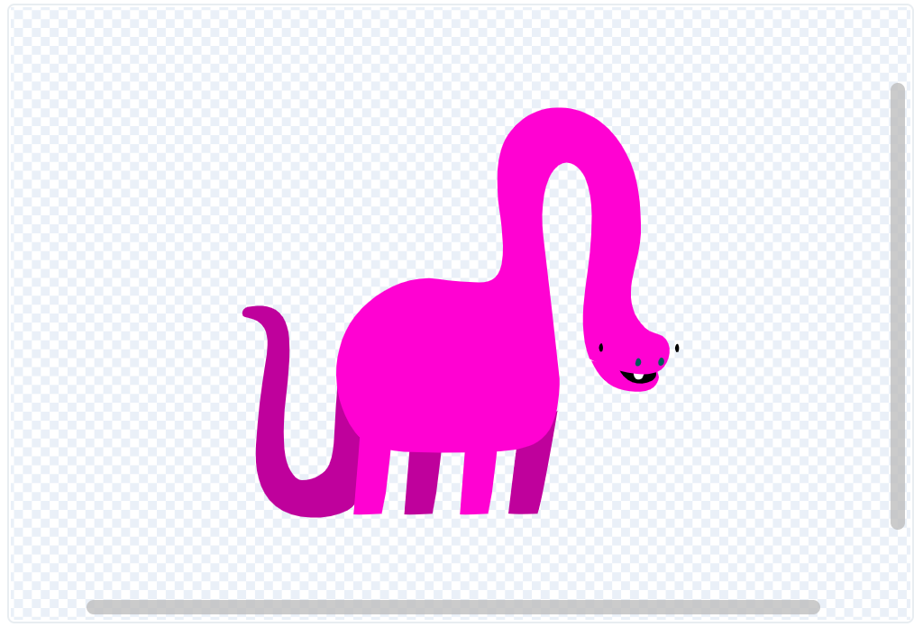

## Add more sprites
Now you've got one sprite moving the way you want it to, you could add another sprite to make your animation more dynamic. 

--- task ---

Start  by duplicating your first sprite to create the starting point for the next. The code gets copied too which saves you time.

--- collapse ---
---

title: Copy a sprite

---

Right click on your first sprite in the Sprite list below the Stage (or if you are using a tablet, tap and hold):
{:width="300px"}

Select 'duplicate'. This will create a copy of your first 1 sprite with the suffix '2'.
:
{:width="300px"}

Rename your sprite:
{:width="300px"}

Your sprite's name will change in the Sprite list:
{:width="300px"}

Your second sprite has exactly the same code as your first sprite. 
--- /collapse ---

--- /task ---

You will not see the second sprite because it is sitting underneath the first sprite. Do not run the program until you have altered the second sprite's position, colour, size or layers.

--- task ---

How big should the sprite be? 
Which direction will it point in?
Will the sprite appear behind or in front or other sprites?

Consider how this sprite might move differently to the first sprite. 

Explore different movement patterns. See step 4

--- /task ---

--- task ---

Selected the second sprite in the Sprite list and click on the **Code** tab.

Edit the code so that the new sprite does what you want it to do.

--- collapse ---
---

title: Position

---

Drag your second sprite to the position you want it to start in.  The second sprite will go to this position when the `when the green flag clicked`{:class="block3events"}.

Alternatively, use the `motion`{:class="block3motion"} block `go to x: () y: ()`{:class="block3motion"} as part of your set-up code so that the sprite will always start from the x and y position that you set.

**Tip**: in programming, there is often more than one way to do something.

--- /collapse ---

--- collapse ---
---

title: Colour

---

Change  the colour of your sprite. Click on the second sprite in the Sprite menu. Then select its **Costumes** tab.

Use the **arrow tool** to highlight whichever part of the costume you want to change colour.

{:width="300px"}

{:width="300px"}

Go to the **Fill tool** and select the colour. It will automatically fill the shape that you have selected.

{:width="300px"}

{:width="300px"}

{:width="300px"}

Repeat the steps above with any part of the costume you have missed or for any other part of the costume you want to changet he colour of.

--- /collapse ---

--- /task ---

--- task ---

Do you need to alter the `point in direction`{:class="block3motion"} and `set rotation style`{:class="block3motion"} to achieve the effect you  want? For a reminder on **How to...** do this explore the earlier step 'Make a sprite bounce'.

--- /task ---

--- task ---

Change the size or layering of the second sprite to improve how it looks in relation to the other sprites and also within the backdrop.

--- collapse ---
---

title: Layers

---

--- /collapse ---

--- /task ---

You may want to tweak the size. It sometimes takes...

--- task ---

If you have time, you can keep adding more sprites. Make each one a little different to the others. 

--- /task ---

--- save ---
