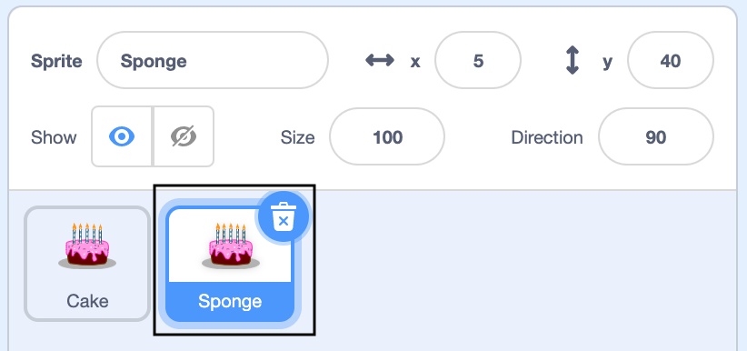

## Add more sprites
Now you've got one sprite moving the way you want it to, you could add another sprite to make your animation more dynamic. 

--- task ---

Start  by duplicating your first sprite to create the starting point for the next. The code gets copied too which saves you time.

--- collapse ---
---

title: Copy a sprite

---

Right click on your first sprite in the Sprite list below the Stage (or if you are using a tablet, tap and hold):
{:width="300px"}

Select 'duplicate'. This will create a copy of your first 1 sprite with the suffix '2'.
:
{:width="300px"}

Rename your sprite:
{:width="300px"}

Your sprite's name will change in the Sprite list:
{:width="300px"}

Your second sprite has exactly the same code atyour first sprite. 
--- /collapse ---

--- /task ---

You will not see the second sprite because it is sitting underneath the first sprite. Do not run the program until you have altered the second sprite's size, colour or position. 

--- task ---

Make sure you have selected the sprite that you want to change and click on the **Code** tab.

Edit the code so that the new sprite does what you want it to do.

How big should the sprite be? 
Which direction will it point in?
Will the sprite appear behind or in front or other sprites?

Consider how this sprite might move differently to the first sprite. 

Explore different movement patterns including.... direction.

--- /task ---

--- collapse ---
---

title: Size

---
Do you need to change the size of the sprites in relation to each other?

--- /collapse ---

--- collapse ---
---

title: Colour

---
--- /collapse ---

--- collapse ---
---

title: Position

---
--- /collapse ---

--- collapse ---
---

title: Facing and direction

---

--- /collapse ---

--- /task ---

--- task ---

Now you can alter where the sprite comes in layers to improve how it sits 3-dimensionally within the scene.

--- collapse ---
---

title: Layers

---

--- /collapse ---

You may want to tweak the size. It sometimes takes...

--- task ---

If you have time, you can keep adding more sprites. Make each one a little different to the others. 

--- /task ---

--- save ---
