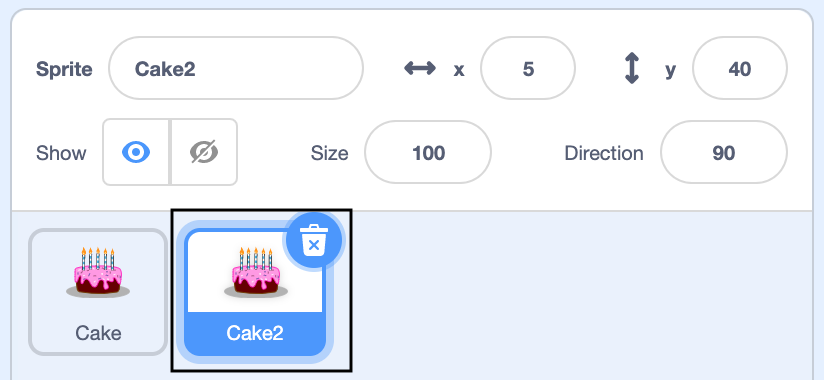

## Add more sprites
Now you've got one sprite moving the way you want it to, add another sprite to make your animation more dynamic. 

--- task ---

**Investigate** the example projects where the sprite movement seems relevant to your ideas.

**Popping balloons** - <a href="https://scratch.mit.edu/projects/435808726/editor" target="_blank" style="background-color: #4d97ff; color: white; font-weight: bold; padding: 1rem; border-radius:.25rem; text-decoration:none;">See inside</a>

**Animal behaviour** - <a href="https://scratch.mit.edu/projects/433177517/editor" target="_blank" style="background-color: #4d97ff; color: white; font-weight: bold; padding: 1rem; border-radius:.25rem; text-decoration:none;">See inside</a>

**Bouncing balls** - <a href="https://scratch.mit.edu/projects/425675232/editor" target="_blank" style="background-color: #4d97ff; color: white; font-weight: bold; padding: 1rem; border-radius:.25rem; text-decoration:none;">See inside</a>

**Love hearts** - <a href="https://scratch.mit.edu/projects/408665598/editor" target="_blank" style="background-color: #4d97ff; color: white; font-weight: bold; padding: 1rem; border-radius:.25rem; text-decoration:none;">See inside</a>

**Tip:** Professional programmers explore and take inspiration from code created by other programmers.

Investigate the **Code** tab of each sprite. Each sprite has a different **algorithm** which makes its behaviour unique:

+ `events`{:class="block3events"} blocks - two of the projects use more than one way to create **user interaction**.

+ `motion`{:class="block3motion"} blocks - **compare** the code used to create the movement for each sprite.

+ explore how various `looks`{:class="block3looks"} blocks are used to alter the size and **appearance** of a sprite.

Investigate the **Costumes** tab:
+  some projects use more than one **costume** to make the animation more interesting or realistic. 

--- /task ---

--- task ---

Either duplicate your first sprite to create the starting point for the next. The code gets copied too which saves you time.

--- collapse ---
---

title: Duplicate a sprite

---

Right click on your first sprite in the Sprite list below the Stage (or if you are using a tablet, tap and hold):
{:width="300px"}

Select 'duplicate'. This will create a copy of your first 1 sprite with the suffix '2'.
:
{:width="300px"}

Rename your sprite:
{:width="300px"}

Your sprite's name will change in the Sprite list:
{:width="300px"}

--- /collapse ---

Or select a new sprite and copy the code from the first sprite to the second sprite

--- collapse ---
---

title: Copy sprite code

---
In the Sprite menu, go to **Choose a Sprite** and select your second sprite.

Click the first sprite and go to its **Code** tab. Drag the code that is int he first sprite to the second sprite. M<akesure you copy all thecode scriptsthatyou have created.,You may have one script that starts with `when the green flag clicked`{:class="block3events"}andanother that starts with `when thissprite clicked`{:class="block3events"}.

{:width="300px"}

--- /collapse ---
--- /task ---

Remember, your second sprite has exactly the same code as your first sprite. Do not run the program until you have begun to alter the second sprite as you will not see the second sprite because it is sitting underneath the first sprite.

--- task ---

Your could alter the second sprite's position, colour or size. Ask yourself the following questions:
+ What position will your second sprite start from?
+ What colour will the second sprite be? Or do you want to change the sprite altogehter?
+ How big should the second sprite be? 
+ Which direction should the second sprite point in?
+ How will the second sprite move differently to the first sprite? What pattern of movement will it have?

+ Will the sprite appear behind or in front or other sprites?

--- /task ---

--- task ---

Selected the second sprite in the Sprite list and click on its **Code** tab.

Now edit the code so that the new sprite does what you want it to do. You may want to delete blocks of code that you used  in the first sprite but do not need for the second sprite.

--- collapse ---
---

title: Deleting  code

---

You can delete blocks of code in a number of ways:
+ Drag individual blocks away from the main script, leaving the blocks with in the Code window. 
+ Delete the blocks of code for good by dragging them towards the Blocks menu.
+ Select the block you want to delete and right-click witth the mouse. Select the 'delete block' option.
{:width="300px"}

**Tip**: in programming, there is often more than one way to do something.

--- /collapse ---

--- /task ---

--- task ---

Use the below **How tos...** to get your second sprite animating as you had planned.

--- collapse ---
---

title: Position

---

Within the Stage, use  the mouse or touch-screen to drag your second sprite to the position you want it to start at the beginning of the animation. The second sprite will go to this position `when the green flag clicked`{:class="block3events"}.

Alternatively, use the `motion`{:class="block3motion"} block `go to x: () y: ()`{:class="block3motion"} as part of your set-up code so that the sprite will always start in the x and y position that you set.

--- /collapse ---

--- collapse ---
---

title: Colour

---

Change  the colour of your sprite. Click on the second sprite in the Sprite menu. Then select its **Costumes** tab.

Use the **arrow tool** to highlight whichever part of the costume you want to change colour.

{:width="300px"}

{:width="300px"}

Go to the **Fill tool** and select the colour. It will automatically fill the shape that you have selected.

{:width="300px"}

Repeat the steps above with any part of the costume you have missed or for any other part of the costume you want to change the colour of.

{:width="300px"}

{:width="300px"}

{:width="300px"}

--- /collapse ---

--- /task ---

--- task ---

Do you need to alter the `point in direction`{:class="block3motion"} and `set rotation style`{:class="block3motion"} to achieve the effect you want? For a reminder on **How to...** do this explore the earlier step 'Make a sprite bounce'.

--- /task ---

--- task ---

Change the size or layering of the second sprite to improve how it looks in relation to the other sprites and also within the backdrop. For a reminder on **How to...** do this explore the earlier step 'Change your sprite's looks'.

--- collapse ---
---

title: Layers

---

--- /collapse ---

--- /task ---

You may want to tweak the position, size, layers etc of your second sprite. It sometimes takes a few attempts before you are pleased with its movement.

--- task ---

If you have time, keep adding more sprites. Make each one a little different to the others. 

--- /task ---

*[algorithm]: A set of precise instructions for performing a task.

--- save ---
