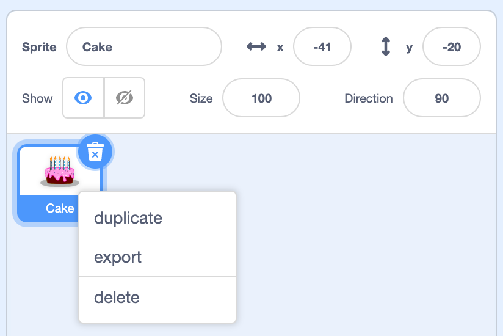
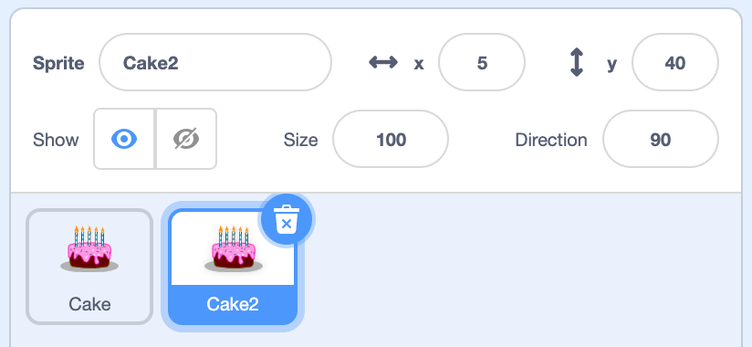
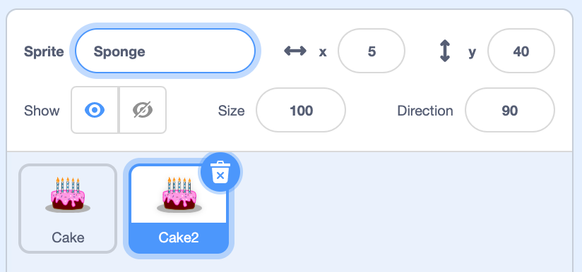
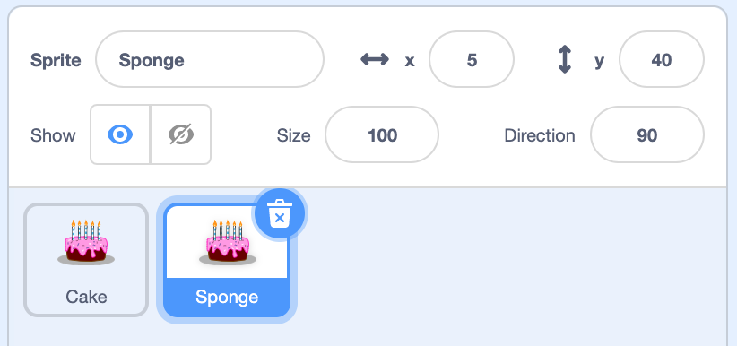
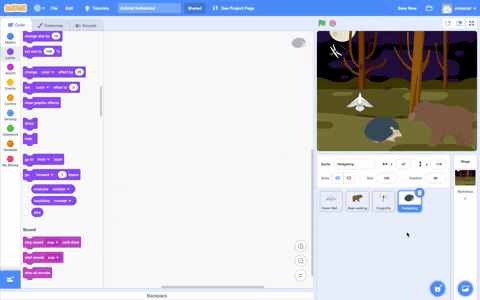
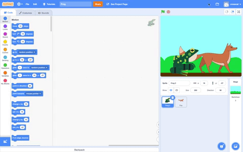

## Add more sprites
Now you've got one sprite moving the way you want it to, add another sprite to make your animation more dynamic.

--- task ---

Each sprite will have a different <span class="keyword">algorithm<span class="definition">A set of precise instructions for performing a task.</span></span> which makes its behaviour unique.

Ask yourself the following questions about your second sprite:
+ Where will you position it?
+ Do you want to change its colour or make it a new costume in the Paint Editor?
+ How big should it be? 
+ Which direction will it be pointing?
+ How will it move differently to the first sprite?

See how this project has two sprites.

**Astronaut and Spaceship** - <a href="https://scratch.mit.edu/projects/438623095/editor" target="_blank" style="background-color: #4d97ff; color: white; font-weight: bold; padding: 1rem; border-radius:.25rem; text-decoration:none;">See inside</a>
<div class="scratch-preview">
  <iframe src="https://scratch.mit.edu/projects/438623095/embed" allowtransparency="true" width="485" height="402" frameborder="0" scrolling="no" allowfullscreen></iframe>
</div>

--- /task ---

--- task ---

You may want to **Investigate** the example projects in **Step 2: Get inspiration**. If so, you could compare the programs of sprites whose movement and appearance are relevant to your project ideas. 

**Tip**: Professional programmers explore and take inspiration from code created by other programmers.

--- /task ---

--- task ---

Choose one of these three methods to create your second sprite: 
+ Duplicate your first sprite if you want multiples of the same sprite
+ Create a new sprite and copy over the first sprite's code 
+ Create a new sprite and start coding it from the beginning

--- collapse ---
---

title: Duplicate a sprite

---

Right click on your first sprite in the Sprite list below the Stage (or if you are using a tablet, tap and hold):
{:width="300px"}

Select 'duplicate'. This will create a copy of your first 1 sprite with the suffix '2':
{:width="300px"}

Rename your sprite:
{:width="300px"}

Your sprite's name will change in the Sprite list:
{:width="300px"}

Your second sprite has exactly the same code as your first sprite. Do not run the program until you have begun to alter the second sprite - you will not see the second sprite because it is sitting underneath the first sprite.

--- /collapse ---

--- collapse ---
---

title: Copy sprite code

---
In the Sprite menu, go to **Choose a Sprite** and select your second sprite.

Click the first sprite and go to its **Code** tab. Drag the code that is in the first sprite to the second sprite. You may have one script that starts with `when the green flag clicked`{:class="block3events"} as well as another script that starts with `when this sprite clicked`{:class="block3events"}. Make sure you copy **all** the code scripts that you have created. 

{:width="300px"}

Your second sprite has exactly the same code as your first sprite. Do not run the program until you have begun to alter the second sprite - you will not see the second sprite because it is sitting underneath the first sprite.

--- /collapse ---

--- /task ---

--- task ---

Now edit the code so that the new sprite animates the way you want it to. 

Go to **Step 4: Animate using  motions** for a reminder on how to add or change the second sprite's `point in direction`{:class="block3motion"} and `set rotation style`{:class="block3motion"}.

--- /task ---

--- task ---

Change how your second sprite appears in relation to the first sprite. Layering sprites helps them appear 3-dimensional in relation to each other and within the backdrop.

--- collapse ---
---

title: Layers

---
There are two ways to create layering.

Either, in the Stage area, click on the sprite you want as the front layer. Drag it over the front of the other sprite. This layering will stay when you run the program next time.

{:width="300px"}


Or, use a `go to front layer`{:class="block3looks"} block to the relevant sprite and select either a drop down `front`{:class="block3looks"} or `back`{:class="block3looks"} and add it to the set-up under a `when green flag clicked`{:class="block3events"} block.

```blocks3
go to [front v] layer
```

--- /collapse ---

--- /task ---

You may want to tweak the position, size, layers etc of your second sprite. It may take a few attempts before you are pleased with your second sprite's movement.

--- task ---

If you have time, keep adding more sprites. Make each one a little different to the others. 

--- /task ---

--- save ---


<style>
.keyword {
  position: relative;
  display: inline-block;
  font-weight:bold;
  border-bottom: 2px dotted black;
}

.keyword .definition {
  visibility: hidden;
  font-weight: normal;
  width: 275px;
  background-color: white;
  color: black;
  text-align: left;
  border-radius: 6px;
  padding: 10px;
  border-width: 2px;
  border-style: solid;
  position: absolute;
  left: 0px;
  top: 35px;
  z-index: 1;
}

.keyword:hover .definition {
  visibility: visible;
}
</style>

